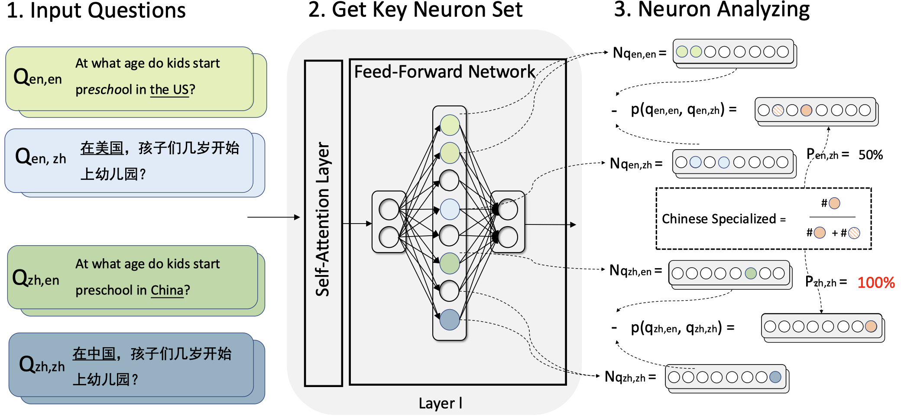

# Disentangling Language Medium and Culture Context for Evaluating Multilingual Large Language Models

---

[](http://arxiv.org/abs/2505.24635) [](https://github.com/yingjiahao14/Dual-Evaluation) [](https://github.com/yingjiahao14/Dual-Eval/blob/master/LICENSE.txt) [](https://yingjiahao14.github.io/Dual-Evaluation/)

This repository contains the implementation code and associated data for our work, **"Disentangling Language Medium and Cultural Context for Evaluating Multilingual Large Language Models,"** published in 2025 ACL Main.

## Brief Introduction

This repository provides the code and data for our paper on multilingual LLMs evaluation. We propose a Dual Evaluation Framework that separately considers linguistic medium and cultural context, enabling more nuanced and comprehensive assessment of LLMs across languages and cultures. Our experiments uncover a "Cultural-Linguistic Synergy" phenomenon—LLMs perform better when the question’s cultural background matches the language. Further analysis suggests that the proportion of activated neurons can indicate model performance in multilingual and multicultural settings. Our findings highlight the importance of both cultural and linguistic factors in LLM evaluation.


<p align="center" width="100%">
<a target="_blank"></a>
</p>


## Prerequisites 

### Step 1: Clone the Repository and Create Environment

```bash
git clone git@github.com:yingjiahao14/Dual-Eval.git
cd Dual-Eval
```

The environment setup for this project follows the guidelines and dependencies outlined in [BLEnD](https://github.com/nlee0212/BLEnD). Please refer to their documentation for detailed instructions on configuring the environment and installing required evaluation dependencies.

### Step 2: **Install Target Tested Models (e.g., Llama-3)**

```bash
# Download the Llama-3 model from Hugging Face and store it locally
huggingface-cli download --resume-download meta-llama/Llama-3-8B-Instruct --local-dir model/Llama-3-8B-Instruct
```

If you have already downloaded the models, you may need to update the corresponding paths in `utils.py` to ensure they point to the correct locations.


## Usage 

**Model  Inference:** Execute the command below to run model inference:

```bash
bash model_inference.sh [OPTIONS]
```

You can customize the inference process by adding the following command-line arguments:

- **--cuda-devices**: Specify which GPU(s) to use (e.g., "0", "0,1").

  *Example*: `--cuda-devices "0,1"`

- **--model-keys**: Provide a comma-separated list of model names to use for inference.

  *Example*: `--model-keys "Llama3-8b-Instruct,gemma-2-9b-it`"

- **--country-lang**: Specify country-language mappings. Use a comma to separate entries, and a colon to separate country and languages (languages separated by semicolons if multiple).

  *Example*: `--country-lang "China:China,UK,US:US,China`"

- **--prompt-numbers**: Specify which prompt numbers to use (comma-separated).

  *Example*: `--prompt-numbers "inst-4"`

Note: If you do not specify these parameters, default values defined in the script will be used.

**Model Evaluation:** To evaluate model outputs, navigate to the evaluation directory and execute:

```bash
cd evaluation/get_performance
bash evaluate.sh [OPTIONS]
```

You can customize the evaluation process by specifying command-line arguments as shown below.

- **--cuda-devices**

  Specify which GPU(s) to use (e.g., "0", "0,1").

  *Example*: `--cuda-devices "0"`

- **--model-keys**

  Comma-separated list of model names to evaluate.

  *Example*: `--model-keys "Llama3-8b-Instruct,gemma-2-9b-it"`

- **--country-lang**

  Specify country-language mappings. Use a comma to separate entries, and a colon to separate country and languages (languages separated by commas if multiple).

  *Example*: `--country-lang "China:China,UK,US:US,China"`

- **--prompt-numbers**

  Comma-separated list of prompt numbers to use for evaluation.

  *Example*: `--prompt-numbers "inst-8"`

**Specialized Neurons Calculation:**  To calculate specialized neurons for your models, follow the steps below:

```bash
# This script extracts key neurons for Q_{i,j}
bash get_neuron.sh 

# Calculates the proportion of specialized neurons for P_{i,j} using the specified threshold mode
python get_specialized_neuron.py --mode [MODE]
```

You can choose different threshold functions for neuron selection by specifying the `--mode` argument in `get_specialized_neuron.py`. The available modes and their possible values are:

- **layer-topk** (default):

- **layer-topscore**:

- **global_topk**:

  

## Citation 

If you find this work helpful, please consider citing:

```bibtex

```

